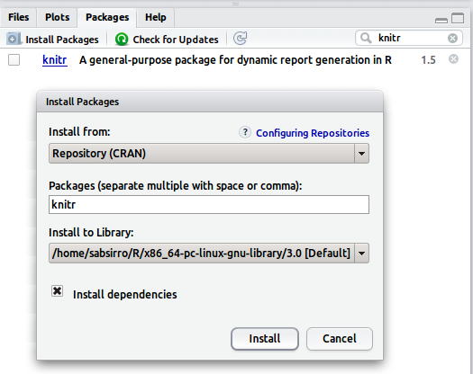
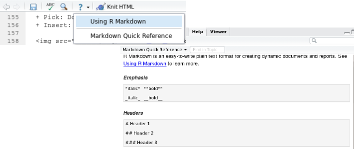
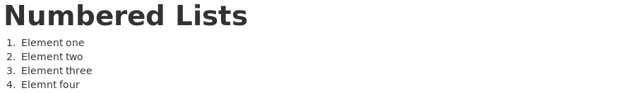
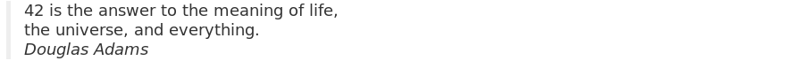
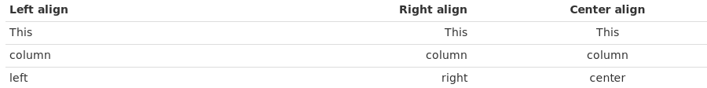
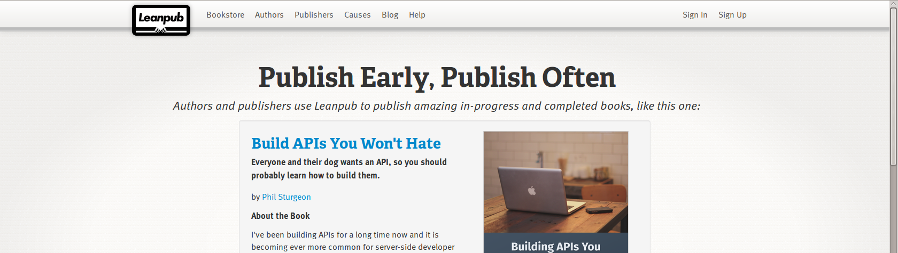
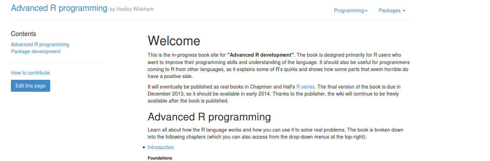

```{r echo = FALSE, include = F, eval = T}
require(knitr)
hook_source_def = knit_hooks$get('source')
knit_hooks$set(source = function(x, options){
  if (!is.null(options$verbatim) && options$verbatim){
    opts = gsub(",\\s*verbatim\\s*=\\s*TRUE\\s*", "", options$params.src)
    bef = sprintf('\n\n    ```{r %s}\n', opts, "\n")
    stringr::str_c(bef, paste(knitr:::indent_block(x, "    "), collapse = '\n'), "\n    ```\n")
  } else {
     hook_source_def(x, options)
  }
})

require(ggplot2)
```

## Reproducible reporting?

Imagine you get an E-Mail 

> Dear Claas
> 
> I was working on an experiment over the last couple of months. Now  
> I am currently analysing the data in R and write down everything  
> for a paper. Could you be so nice and read through my manuscript  
> and give me feedback?  
> -- *All the best Karl*  

<a href="assets/files/mardown_file_from_letter.Rmd" class="btn"><i class="icon-envelope"></i> Attachment.Rmd</a>

* Only one file? (.Rmd)
* Expected 2 files (.R, .docx)
  
* RStudio can open it (please open it now)!
  - You dont understand the syntax. (A mix of text and code?)

---

## Reproducible reporting?

* You ask him

> Dear Claas
> 
> The ending (.Rmd) stands for R-Markdown. Markdown is a  
> lightweight markup language for text. It can be combined  
> with chunks of R-Code and then we speak of R-Markdown.  
> It can be used for dynamic reproducible report creation.
>
> The document can be turned into an nicely formatted HTML page  
> where the code chunks are executed and replaced by their output.  
> Just install the `knitr` R package first and then  
> hit the knit to HTML button in your RStudio!  
> -- *All the best Karl*  

* Rmd stands for R-Markdown
  - Intermixes markdown markup + R-Code
  - `knitr` can turn this innto HTML

* We follow his instructions and install `knitr`

--- bg:#EEE

## Reproducible reporting?

* R-Studio way: Packages > Install Packages

    

* On console:
  - `install.packages("knitr")`
  
<a href="http://www.rstudio.com/ide/download/" class="btn flushfooter"><i class="icon-download"></i> Get R-Studio</a>

--- bg:#EEE

## Reproducible reporting?

* Knit his file: 
  - hit `knit HTML` button
  
  
    
  - you get HTML output
 
  

---

## Reproducible reporting?

</br>

* You start to get the idea
  - only 1 document!
  - prevents copy + paste
  - less error prone
  - always up to date documents
  - saves work time and your nerves
  - BUT HTML?

---

## Reproducible reporting?

* Knitr R package (Yuhui Xie, 2012)
  * dynamic report generator 
  
* R-Markdown -> HTML
  - Steps: .Rmd -> .md -> .html
  - Generate HTML reports (e.g research blogs, etc)

* LaTeX -> PDF
  - Steps: .Rnw -> .tex -> .PDF
  - Generate PDF reports (for Ba./Ma. Thesis, etc.)

* R-Studio improves integrationn (Version 0.98.1028)
  - From markdown -> .html, .PDF, word

<div class = "flushfooter">
<a href="http://yihui.name/knitr/" class="btn"><i class="icon-home"></i> Knitr</a> <a href="http://cpfaff.github.io/reproducibility/#1" class="btn"><i class="icon-book"></i> Repro. reporting (full course with latex)</a>
</div>

---

## R-Markdown and R-Studio

- Create a .Rmd file 
  + file > new > R-Markdown
- In wizward (~ since Version 0.98.1028)
  + Pick: Document type/ Format (HTML)
  + Insert: Name and Title
    
  

---

## R-Markdown and R-Studio

- The new document 


---

## R-Markdown and R-Studio

- Content sensitive menu bar
  + Knit to HTML
  + Chunk Menu (Insert, Execute)

  

- Help (pops up in help browser)

 

---

## R-Markdown Syntax (Metadata)

* Optional and R-Studio specific (embraced by ---)
* Example: 

```
---
title: "This is my test title"
author: "Claas-Thido Pfaff"
date: "06.09.2014"
output: html_document
---
```
</br>


---

## R-Markdown Syntax (headers)

* Headers for chapters and sections (Hash)

  ```
  # Header ones
  ## Header two
  ### Header three
  ...
  ###### Header six
  ```

* Example 


---

## R-Markdown Syntax (lists)

* Numbered list (digits + .) 
  - 1.,2.,3.,...,n

  ```
  1. One
  2. Two
  3. Three
  4. Four
  ```

* Example

</br>


---

## R-Markdown Syntax (lists)
  
* Bullet list (symb: *, +, -; nesting 4 spaces)

```
* One
* Two
    + Two one
    + Two two
        - Two two one
* Three
    1. Three one
    2. Three two
```


---

## R-Markdown Syntax (emphasis)

```
This is *italic* (sometimes also _italic_)
```

- This is *italic*
 
```
This is **bold** (sometimies also __bold__)
```
 
- This is **bold**

```
This is ***bold and italic*** (sometimes also ___bat___)
```

- This is ***bold and italic***

* Example
</br>


---

## R-Markdown Syntax (quotes)

</br>

* Qouting with (greater than ">")

```{r eval = F, include = T}
> 42 is the answer to the meaning of life, 
> the universe, and everything.
> *Douglas Adams*
```

</br>

* Output:



---

## R-Markdown Syntax (tables)

</br>

* Source (align colon)


* Output



<a href="http://www.tablesgenerator.com/markdown_tables" class="btn"><i class="icon-home"></i> Table Generator</a>


---

## R-Markdown Syntax (links)

* URL or path to files

  ```
  [link text](url or relative path "Some Text")
  ```
  
  - https://github.com/
  - path/to/test.html

* Example 

  ```
  [GitHub](https://github.com/ "Build software better, together.")
  ```
  
  [GitHub](https://github.com/ "Build software better, together.")

* You can also simply paste in URLs `https://github.com/` (see above)

---

## R-Markdown Syntax (links)

* Links as References
  - Reference sections/figures/tables
  - Not as sophisticated as Microsoft Word, Open Office, LaTeX
  - But you can use HTML anchors

* Set anchor

  ```
  <!-- set an html anchor -->
  <a name="abcd"></a>
  ```
  
* Set reference in text

  ```
  <!-- refer in markdown syntax -->
  [link text](#abcd)
  ```

---

## R-Markdown Syntax (images)

```

```


* No direct control over size (HTML)

> ``

<a href="http://bit.ly/1hI3LFC" class="btn flushfooter"><i class="icon-picture"></i> Image Source</a>

---

## R-Markdown Syntax (formulas)

* Not included in basic markdown 
  - Need external frameworks (mathjax)
* Inline formulas `$ ... $`
* Display formulas `$$ ... $$` (`<div> formula </div>`)
 
```
$$V_t(S_t) = \max_{x_t \in \chi_t} \left(C(S_t, x_t) + 
            \gamma \sum_{s^{\prime} \in \mathcal{S}}  
            \mathbb{P}(s^{\prime} | S_t^n, x_t)  
            V_{t+1}^{n-1} s^{\prime} \right)$$
```

<div>$$V_t(S_t) = \max_{x_t \in \chi_t} \left(C(S_t, x_t) + 
            \gamma \sum_{s^{\prime} \in \mathcal{S}} \mathbb{P}(s^{\prime} | S_t^n, x_t) V_{t+1}^{n-1} s^{\prime} \right)$$</div>

<div class = "flushfooter">
<a href="http://bit.ly/5OfRvi" class="btn"><i class="icon-home"></i> Mathjax Home</a> <a href="http://bit.ly/2iGPm" class="btn"><i class="icon-book"></i> Formula Syntax</a> <a href="http://detexify.kirelabs.org/classify.html" class="btn"><i class="icon-home"></i> Detexify</a>
</div>


--- 

## R-Markdown Syntax (code)

* code blocks (3 Backticks)

  \`\`\`  
  Text or code goes here  
  \`\`\`  
    
  ``` 
  myfunction <- function(x,y){
                  z <- x+y;       
                  return(z)     
                } 
  ```

* In line `code`

  ```
  In text `code` hightlight
  ```

---  

## R-Markdown Syntax (code chunks)

A code blocks plus (curly braces, r, options)

    ```{r preparation, cache = TRUE, include = TRUE, eval = TRUE, echo = TRUE}`r ''`
    x = c(1,2,3,4,5)
    y = summary(x)
    ```

* Modify how the chunk is treated (chunk options)
  - include = (T)/F (include chunk in output)
  - echo = (T)/F (include source code)
  - eval = (T)/F (evaluate chunk)
  - cache = T/(F) (cache chunk)
  - and others ...

<a href="http://yihui.name/knitr/options#chunk_options" class="btn flushfooter"><i class="icon-book"></i> Knitr chunk options</a>

---

## R-Markdown Syntax (inline code)

Prepare Code:

Option: `include = FALSE`

```{r eval = T, include = F}
x = c(1,2,3,4,5)
mean_of_x = mean(x)
```

    ```{r preparation, include = F}`r ''`
    x = c(1,2,3,4,5)
    mean_of_x = mean(x)
    ```
    
Use in your text with inline code chunks:

```
Lorem ipsum dolor sit ` r x + 10` amet, consetetur sadipscing  
elitr, the mean of x is ` r mean_of_x` ...
```

Lorem ipsum dolor sit `r x + 10` amet, consetetur sadipscing  
elitr, the mean of x is `r mean_of_x` ...

--- 

## R-Markdown Syntax (plots)
  
Example plot:

    ```{r how_to_include_plots, fig.width = 8, fig.height = 5, fig.align = 'center'}`r ''`
    require(ggplot2)
    qplot(Sepal.Length, Petal.Length, data = iris, color = Species,
              xlab = "Sepal Length", ylab = "Petal Length",
              main = "Sepal vs. Petal Length in Fisher's Iris data")
    ```
    
* Options
  - figure.width 
  - figure.height
  - fig.align [center, left, right]

* The width and height are in inch!

---

## R-Markdown Syntax (plots)

```{r fig.width = 8, fig.height = 5, fig.align = 'center'}
qplot(Sepal.Length, Petal.Length, data = iris, color = Species,
  xlab = "Sepal Length", ylab = "Petal Length",
  main = "Sepal vs. Petal Length in Fisher's Iris data")
```

--- bg:#EEE

## Your turn (plots)

1. Create 3rd level header: e.g "Plots"
2. Create a chunk that is not displayed! (hint: include)
  - load the `ggplot2` package in that chunk
3. Create another chunk (use `qplot`)
  - data = mtcars
  - x = mpg (miles per US galon)
  - y = wt (weight in lb (pound))
  - if you like map cylinders (colour = cyl) to color
4. Knit to HTML
5. Play around with the alignment and size options!
  - center the plot!
  - resize till it looks correct

--- bg:#EEE

## Your turn (plots)

The preparation chunk:
  
    ```{r preparation, include = F}`r ''`
    require(ggplot2)
    ```
    
Needs option: `include = FALSE`

* If startup messages appear use:

```
suppressPackageStartupMessages(library(gdata))
```

--- bg:#EEE  

## Your turn (plots)

The plot chunk:


    ```{r plotchunk, fig.align = 'center', fig.width = 6, fig.height = 4}`r ''`
    qplot(mpg, wt, data=mtcars, colour=cyl)
    ```

```{r fig.align = 'center', fig.width = 6, fig.height = 4, echo = F}
qplot(mpg, wt, data=mtcars, colour=cyl)
```

---

## R-Markdown Syntax (tables)

Knitr can create markdown tables for you (Amazing!) 


    ```{r results = 'asis'}`r ''`
    kable(head(iris[,1:3]), format = "markdown")   
    ```

* requires chunk option: `results = 'asis'`

* Use the kable command

* kable parameters:
  - `align = c("c", "l", "r")`
  - `digits = 3` 
  - `row.names = T/F`

---

## R-Markdown Syntax (tables)

* Knitr can create markdown tables for you!
  - needs chunk option: `results = 'asis'`

```{r, results = 'asis'}
kable(head(iris[,1:3]), format = "markdown")
```

--- bg:#EEE

## Your turn (tables)

</br> 

1. Create 3rd level header: e.g "Automagical Tables"
1. Create a chunk that is not shown! (hint: include)
  - prepare 7 first rows of the `mtcars` dataset in a variable (hint: head)
1. Create another chunk
  - use kable to display the 7 rows (hint: results = 'asis') 
  - do not forget to set kable option (format = "markdown") 
  - truncate the digits to 1 (digits = 1)
1. Knit to HTML

--- bg:#EEE

## Your turn (tables)

The preparation chunk:
  
    ```{r preparation, include = F}`r ''`
    subset_of_mtcars = head(mtcars, 7)
    ```

* sets `include = F` 

The table chunk:

    ```{r themagictable, results = 'asis'}`r ''`
    kable(subset_of_mtcars, format = "markdown", digits = 1)
    ```

* as output is already markdown we set: `results = 'asis'`
* truncate: `digits = 1`

--- bg:#EEE

## Your turn (tables)

The table:

```{r preparation, include = F, eval = T}
subset_of_mtcars = head(mtcars, 7)
```

```{r themagictable, results = 'asis'}
kable(subset_of_mtcars, format = "markdown", digits = 1)
```

---

## Where can I use it?

* GitHub (Software Development Platform)
  - Version management based on Git
  - Github Pages (used for this presentation!)
  
      

---

## Where can I use it?

* RStudio and RPubs

    

* Howto?
  - Knit: .Rmd -> .md -> .html
  - In preview windows click publish (needs account!)
  
      

--- 

## Where else it is used?

* Leanpub (Publish your books!)



* Advanced Programming in R (Hadley Wickham, knitr, mardown, pandoc etc..)



<div class="flushfooter">
  <a href="https://leanpub.com" class="btn"><i class="icon-home"></i> Leanpub</a> <a href="http://adv-r.had.co.nz/" class="btn"><i class="icon-book"></i> Advanced R Programming</a>
<div>

---

## Need a word document to share?

* You can use the conversion in R-Studio (word, open-office)

```
---
output_format: html_document
---
```

```
---
output_format: word_document
---
```

* As a way to create 
  - publishable manuscripts
  - documents to share with your supervisor

* Try a word conversion now (requires word, open-office)!

<a href="assets/files/mardown_file_from_letter.Rmd" class="btn"><i class="icon-envelope"></i> Attachment.Rmd</a>

---

## Wrapup

* Markdown
  - write for the web (easy to learn)
  - but has its limitations (e.g. figure size, references, citations)
  - Scholary markdown, http://bit.ly/11y0p23
  
> What happens if you ask for too much power from Markdown?  
> – *Yihui Xie*  


      
<div class = "flushfooter">
  <a href="http://yihui.name/en/2013/10/markdown-or-latex/" class="btn"><i class="icon-picture"></i> Blog-Post (Yihui)</a>
</div>

---

## Wrapup

- conversion from MD works great in most cases (flexible)
- More complex documents (print, PDF) LaTeX is better
- Supports you with (references, citation, formulas, ...)
- But is much harder to learn

--- bg:#EEE

## Reproduce this slides!

</br>

* download the slides (button below!)
* unzip the archive
* open the folder
  - open in Rstudio: `index.Rmd` 
  - NOTE: Do not change anything in the file!
* knit it to HTML!
* do you get what you expected?

<a href="https://github.com/cpfaff/repromarkdown/archive/gh-pages.zip" class="btn flushfooter"><i class="icon-download"></i> Get this presentation</a>  

---

## Wrapup: Which format to choose?

* Markdown
  - designed to write for the web
  - easy to learn and write
  - Syntax: http://daringfireball.net/projects/markdown/
  - but has its limitations (e.g. figure size, references)
  - markdown flavours support more features (multidoc)
  
> What happens if you ask for too much power from Markdown?  
> – *Yihui Xie*  


      
<div class = "flushfooter">
  <a href="http://yihui.name/en/2013/10/markdown-or-latex/" class="btn"><i class="icon-picture"></i> Blog-Post (Yihui)</a>
</div>

---


--- bg:#EEE

## Reproduce this slides!

</br>

* install devtools:

```
install.packages("devtools")
require(devtools)
```

* install slidify:

```
install_github('slidify', 'ramnathv')
install_github('slidifyLibraries', 'ramnathv')
require(slidify)
```

* knit to HTML again

---

<div class = "flushcenter">
     <h1>Thanks for your attention!</h1>
</div>

<a href="https://github.com/cpfaff/repromarkdown/archive/gh-pages.zip" class="btn flushfooter"><i class="icon-download"></i> Get this presentation</a>  

---

--- bg:#EEE

## What is reproducible reporting?

* Open your R-Studio (+ new R script)

* try: 

```
require(knitr)
require(rmarkdown)
require(ggplot2)
```

* Create a folder on your desktop (mylibrary)

* Add that folder to you library paths in R

```
.libPaths( c( .libPaths(), "c:/users/username/desktop/mylibrary"))
```

* Install the requirements

```
install.packages(c("knitr", "rmakrdown", "ggplot2"), lib = "c:/users/username/desktop/mylibrary")
```
